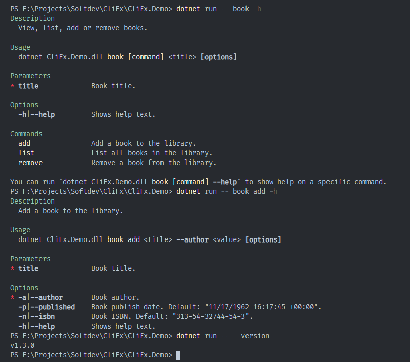

# CliFx

[](https://ci.appveyor.com/project/Tyrrrz/CliFx/branch/master)
[](https://ci.appveyor.com/project/Tyrrrz/CliFx/branch/master/tests)
[](https://codecov.io/gh/Tyrrrz/CliFx)
[](https://nuget.org/packages/CliFx)
[](https://nuget.org/packages/CliFx)
[](https://patreon.com/tyrrrz)
[](https://buymeacoffee.com/tyrrrz)

CliFx is a simple to use but powerful framework for building command line applications. Its primary goal is to completely take over the user input layer, letting you focus more on writing your application. This framework uses a declarative approach for defining commands, avoiding excessive boilerplate code and complex configurations.

_CliFx is to command line interfaces what ASP.NET Core is to web applications._

## Download

- [NuGet](https://nuget.org/packages/CliFx): `dotnet add package CliFx`
- [Continuous integration](https://ci.appveyor.com/project/Tyrrrz/CliFx)

## Features

- Complete application framework, not just an argument parser
- Requires minimal amount of code to get started
- Resolves commands and options using attributes
- Handles options of various types, including custom types
- Supports multi-level command hierarchies
- Allows cancellation
- Generates contextual help text
- Prints errors and routes exit codes on exceptions
- Highly testable and easy to debug
- Targets .NET Framework 4.5+ and .NET Standard 2.0+
- No external dependencies

## Screenshots



## Argument syntax

This library employs a variation of the GNU command line argument syntax. Because CliFx uses a context-unaware parser, the syntax rules are generally more consistent and intuitive.

The following examples are valid for any application created with CliFx:

- `myapp --foo bar` sets option `"foo"` to value `"bar"`
- `myapp -f bar` sets option `'f'` to value `"bar"`
- `myapp --switch` sets option `"switch"` to value `true`
- `myapp -s` sets option `'s'` to value `true`
- `myapp -abc` sets options `'a'`, `'b'` and `'c'` to value `true`
- `myapp -xqf bar` sets options `'x'` and `'q'` to value `true`, and option `'f'` to value `"bar"`
- `myapp -i file1.txt file2.txt` sets option `'i'` to a sequence of values `"file1.txt"` and `"file2.txt"`
- `myapp -i file1.txt -i file2.txt` sets option `'i'` to a sequence of values `"file1.txt"` and `"file2.txt"`
- `myapp jar new -o cookie` invokes command `jar new` and sets option `'o'` to value `"cookie"`

## Usage

### Configuring application

To turn your application into a command line interface you need to change your program's `Main` method so that it delegates execution to `CliApplication`.

The following code will create and run default `CliApplication` that will resolve commands defined in the calling assembly. Using fluent interface provided by `CliApplicationBuilder` you can easily configure different aspects of your application.

```c#
public static class Program
{
    public static Task<int> Main(string[] args) =>
        new CliApplicationBuilder()
            .AddCommandsFromThisAssembly()
            .Build()
            .RunAsync(args);
}
```

### Defining commands

In order to add functionality to your application you need to define commands. Commands are essentially entry points for the user to interact with your application. You can think of them as something similar to controllers in ASP.NET Core applications.

In CliFx you define a command by making a new class that implements `ICommand` and annotating it with `CommandAttribute`. To specify properties that will be set from command line you need to annotate them with `CommandOptionAttribute`.

Here's an example command that calculates logarithm. It has a name (`"log"`) which the user needs to specify in order to invoke it. It also contains two options, the source value (`"value"`/`'v'`) and logarithm base (`"base"`/`'b'`).

```c#
[Command("log", Description = "Calculate the logarithm of a value.")]
public class LogCommand : ICommand
{
    [CommandOption("value", 'v', IsRequired = true, Description = "Value whose logarithm is to be found.")]
    public double Value { get; set; }

    [CommandOption("base", 'b', Description = "Logarithm base.")]
    public double Base { get; set; } = 10;

    public Task ExecuteAsync(IConsole console)
    {
        var result = Math.Log(Value, Base);
        console.Output.WriteLine(result);

        return Task.CompletedTask;
    }
}
```

By implementing `ICommand` this class also provides `ExecuteAsync` method. This is the method that gets called when the user invokes the command. Its return type is `Task` in order to facilitate asynchronous execution, but if your command runs synchronously you can simply return `Task.CompletedTask`.

The `ExecuteAsync` method also takes an instance of `IConsole` as a parameter. You should use the `console` parameter in places where you would normally use `System.Console`, in order to make your command testable.

Finally, the command defined above can be executed from the command line in one of the following ways:

- `myapp log -v 1000`
- `myapp log --value 8 --base 2`
- `myapp log -v 81 -b 3`

### Option conversion

When resolving options, CliFx can convert string values obtained from the command line to any of the following types:

- Standard types
  - Primitive types (`int`, `bool`, `double`, `ulong`, `char`, etc)
  - Date and time types (`DateTime`, `DateTimeOffset`, `TimeSpan`)
  - Enum types
- String-initializable types
  - Types with constructor that accepts a single `string` parameter (`FileInfo`, `DirectoryInfo`, etc)
  - Types with static method `Parse` that accepts a single `string` parameter and an `IFormatProvider` parameter
  - Types with static method `Parse` that accepts a single `string` parameter
- Nullable versions of all above types (`decimal?`, `TimeSpan?`, etc)
- Collections of all above types
  - Array types (`T[]`)
  - Types that are assignable from arrays (`IReadOnlyList<T>`, `ICollection<T>`, etc)
  - Types with constructor that accepts a single `T[]` parameter (`HashSet<T>`, `List<T>`, etc)

If you want to define an option of your own type, the easiest way to do it is to make sure that your type is string-initializable, as explained above.

It is also possible to configure the application to use your own converter, by calling `UseCommandOptionInputConverter` method on `CliApplicationBuilder`.

```c#
var app = new CliApplicationBuilder()
    .AddCommandsFromThisAssembly()
    .UseCommandOptionInputConverter(new MyConverter())
    .Build();
```

The converter class must implement `ICommandOptionInputConverter` but you can also derive from `CommandOptionInputConverter` to extend the default behavior.

```c#
public class MyConverter : CommandOptionInputConverter
{
    protected override object ConvertValue(string value, Type targetType)
    {
        // Custom conversion for MyType
        if (targetType == typeof(MyType))
        {
            // ...
        }

        // Default behavior for other types
        return base.ConvertValue(value, targetType);
    }
}
```

### Reporting errors

You may have noticed that commands in CliFx don't return exit codes. This is by design as exit codes are considered a higher-level concern and thus handled by `CliApplication`, not by individual commands.

Commands can report execution failure simply by throwing exceptions just like any other C# code. When an exception is thrown, `CliApplication` will catch it, print the error, and return an appropriate exit code to the calling process.

If you want to communicate a specific error through exit code, you can throw an instance of `CommandException` which takes exit code as a constructor parameter.

```c#
[Command]
public class DivideCommand : ICommand
{
    [CommandOption("dividend", IsRequired = true)]
    public double Dividend { get; set; }

    [CommandOption("divisor", IsRequired = true)]
    public double Divisor { get; set; }

    public Task ExecuteAsync(IConsole console)
    {
        if (Math.Abs(Divisor) < double.Epsilon)
        {
            // This will print the error and set exit code to 1337
            throw new CommandException("Division by zero is not supported.", 1337);
        }

        var result = Dividend / Divisor;
        console.Output.WriteLine(result);

        return Task.CompletedTask;
    }
}
```

### Child commands

In a more complex application you may need to build a hierarchy of commands. CliFx takes the approach of resolving hierarchy at runtime based on command names, so you don't have to specify any parent-child relationships explicitly.

If you have a command `"cmd"` and you want to define commands `"sub1"` and `"sub2"` as its children, simply name them accordingly.

```c#
[Command("cmd")]
public class ParentCommand : ICommand
{
    // ...
}

[Command("cmd sub1")]
public class FirstSubCommand : ICommand
{
    // ...
}

[Command("cmd sub2")]
public class SecondSubCommand : ICommand
{
    // ...
}
```

### Cancellation

It is possible to gracefully cancel execution of a command and preform any necessary cleanup. By default an app gets forcefully killed when it receives an interrupt signal (Ctrl+C or Ctrl+Break). Make call to `console.RegisterCancellation()` to override the default behavior and get `CancellationToken` that represents the first interrupt signal. Second interrupt signal terminates an app immediately. 

You can pass `CancellationToken` around and check its state. Make sure you catch `TaskCancelledException`, `OperationCancelledException` with other possible cancellation exceptions.

Cancelled or terminated app returns non-zero exit code.

```c#
[Command("cancel")]
public class CancellableCommand : ICommand
{
    public async Task ExecuteAsync(IConsole console)
    {
        console.Output.WriteLine("Printed");

		// Long-running cancellable operation that throws when canceled
        await Task.Delay(Timeout.InfiniteTimeSpan, console.RegisterCancellation());

        console.Output.WriteLine("Never printed");
    }
}
```

### Dependency injection

CliFx uses an implementation of `ICommandFactory` to initialize commands and by default it only works with types that have parameterless constructors.

In real-life scenarios your commands will most likely have dependencies that need to be injected. CliFx doesn't come with its own dependency container but instead it makes it really easy to integrate any 3rd party dependency container of your choice.

For example, here is how you would configure your application to use [`Microsoft.Extensions.DependencyInjection`](https://nuget.org/packages/Microsoft.Extensions.DependencyInjection) (aka the built-in dependency container in ASP.NET Core).

```c#
public static class Program
{
    public static Task<int> Main(string[] args)
    {
        var services = new ServiceCollection();

        // Register services
        services.AddSingleton<MyService>();

        // Register commands
        services.AddTransient<MyCommand>();

        var serviceProvider = services.BuildServiceProvider();

        return new CliApplicationBuilder()
            .AddCommandsFromThisAssembly()
            .UseCommandFactory(schema => (ICommand) serviceProvider.GetRequiredService(schema.Type))
            .Build()
            .RunAsync(args);
    }
}
```

### Option validation

Similar to dependency injection, CliFx offers complete flexibility when it comes to option validation.

The following example demonstrates how to add validation to commands using [`FluentValidation`](https://github.com/JeremySkinner/FluentValidation).

```c#
[Command("user add")]
public class UserAddCommand : ICommand
{
    [CommandOption("name", 'n', IsRequired = true)]
    public string Username { get; set; }

    [CommandOption("email", 'e')]
    public string Email { get; set; }

    public Task ExecuteAsync(IConsole console)
    {
        var validationResult = new UserAddCommandValidator().Validate(this);
        if (!validationResult.IsValid)
            throw new CommandException(validationResult.ToString());

        // ...
    }
}
```

```c#
public class UserAddCommandValidator : AbstractValidator<UserAddCommand>
{
    public UserAddCommandValidator()
    {
        RuleFor(u => u.Username).NotEmpty().Length(0, 255);
        RuleFor(u => u.Email).EmailAddress();
    }
}
```

### Resolve commands from other assemblies

In most cases, your commands will be defined in your main assembly which is where CliFx will look if you initialize the application using the following code.

```c#
var app = new CliApplicationBuilder().AddCommandsFromThisAssembly().Build();
```

If you want to configure your application to resolve specific commands or commands from another assembly you can use `AddCommand` and `AddCommandsFrom` methods for that.

```c#
var app = new CliApplicationBuilder()
    .AddCommand(typeof(CommandA)) // include CommandA specifically
    .AddCommand(typeof(CommandB)) // include CommandB specifically
    .AddCommandsFrom(typeof(CommandC).Assembly) // include all commands from assembly that contains CommandC
    .Build();
```

### Report progress

CliFx comes with a simple utility for reporting progress to the console, `ProgressTicker`, which renders progress in-place on every tick.

It implements a well-known `IProgress<double>` interface so you can pass it to methods that are aware of this abstraction.

To avoid polluting output when it's not bound to a console, `ProgressTicker` will simply no-op if stdout is redirected.

```c#
var progressTicker = console.CreateProgressTicker();

for (var i = 0.0; i <= 1; i += 0.01)
    progressTicker.Report(i);
```

### Testing

CliFx makes it really easy to test your commands thanks to the `IConsole` interface.

When writing tests, you can use `VirtualConsole` which lets you provide your own streams in place of your application's stdin, stdout and stderr. It has multiple constructor overloads allowing you to specify the exact set of streams that you want. Streams that are not provided are replaced with stubs, i.e. `VirtualConsole` doesn't leak to `System.Console` in any way.

Let's assume you want to test a simple command such as this one.

```c#
[Command]
public class ConcatCommand : ICommand
{
    [CommandOption("left")]
    public string Left { get; set; } = "Hello";

    [CommandOption("right")]
    public string Right { get; set; } = "world";

    public Task ExecuteAsync(IConsole console)
    {
        console.Output.Write(Left);
        console.Output.Write(' ');
        console.Output.Write(Right);

        return Task.CompletedTask;
    }
}
```

By substituting `IConsole` you can write your test cases like this.

```c#
[Test]
public async Task ConcatCommand_Test()
{
    // Arrange
    using (var stdout = new StringWriter())
    {
        var console = new VirtualConsole(stdout);

        var command = new ConcatCommand
        {
            Left = "foo",
            Right = "bar"
        };

        // Act
        await command.ExecuteAsync(console);

        // Assert
        Assert.That(stdout.ToString(), Is.EqualTo("foo bar"));
    }
}
```

And if you want, you can even test the whole application in a similar fashion.

```c#
[Test]
public async Task ConcatCommand_Test()
{
    // Arrange
    using (var stdout = new StringWriter())
    {
        var console = new VirtualConsole(stdout);

        var app = new CliApplicationBuilder()
            .AddCommand(typeof(ConcatCommand))
            .UseConsole(console)
            .Build();

        var args = new[] {"--left", "foo", "--right", "bar"};

        // Act
        await app.RunAsync(args);

        // Assert
        Assert.That(stdout.ToString(), Is.EqualTo("foo bar"));
    }
}
```

### Debug and preview mode

When troubleshooting issues, you may find it useful to run your app in debug or preview mode. To do it, simply pass the corresponding directive to your app along with other command line arguments, e.g.: `myapp [debug] user add -n "John Doe" -e john.doe@example.com`

If your application is ran in debug mode (`[debug]` directive), it will wait for debugger to be attached before proceeding. This is useful for debugging apps that were ran outside of your IDE.

If preview mode is specified (`[preview]` directive), the app will print consumed command line arguments as they were parsed. This is useful when troubleshooting issues related to option parsing.

You can also disallow these directives, e.g. when running in production, by calling `AllowDebugMode` and `AllowPreviewMode` methods on `CliApplicationBuilder`.

```c#
var app = new CliApplicationBuilder()
    .AddCommandsFromThisAssembly()
    .AllowDebugMode(true) // allow debug mode
    .AllowPreviewMode(false) // disallow preview mode
    .Build();
```

## Benchmarks

Here's how CliFx's execution overhead compares to that of other libraries.

```ini
BenchmarkDotNet=v0.11.5, OS=Windows 10.0.14393.3144 (1607/AnniversaryUpdate/Redstone1)
Intel Core i5-4460 CPU 3.20GHz (Haswell), 1 CPU, 4 logical and 4 physical cores
Frequency=3125011 Hz, Resolution=319.9989 ns, Timer=TSC
.NET Core SDK=2.2.401
  [Host] : .NET Core 2.2.6 (CoreCLR 4.6.27817.03, CoreFX 4.6.27818.02), 64bit RyuJIT
  Core   : .NET Core 2.2.6 (CoreCLR 4.6.27817.03, CoreFX 4.6.27818.02), 64bit RyuJIT

Job=Core  Runtime=Core
```

|                               Method |      Mean |     Error |    StdDev | Ratio | RatioSD | Rank |
|------------------------------------- |----------:|----------:|----------:|------:|--------:|-----:|
|                                CliFx |  31.29 us | 0.6147 us | 0.7774 us |  1.00 |    0.00 |    2 |
|                   System.CommandLine | 184.44 us | 3.4993 us | 4.0297 us |  5.90 |    0.21 |    4 |
| McMaster.Extensions.CommandLineUtils | 165.50 us | 1.4805 us | 1.3124 us |  5.33 |    0.13 |    3 |
|                    CommandLineParser |  26.65 us | 0.5530 us | 0.5679 us |  0.85 |    0.03 |    1 |
|                            PowerArgs | 405.44 us | 7.7133 us | 9.1821 us | 12.96 |    0.47 |    6 |
|                                Clipr | 220.82 us | 4.4567 us | 4.9536 us |  7.06 |    0.25 |    5 |

## Philosophy

Given that there are probably a dozen libraries that help with building CLI applications, I wanted to add this section to explain how is CliFx any different and what are the driving vectors for its design.

- **Application framework**. CliFx is not a command line parser, CliFx is an application framework. It takes care of the whole input layer so that you may as well forget you're writing a command line application. While a regular console application has one entry point, the `Main()` method, in CliFx each command is a separate entry point, elevating the abstraction one level higher.

- **Declarative setup**. CliFx makes it easier to think of your CLI more as a class library than an application. As a library it has an API defined in a form of classes and properties, so there shouldn't be any reason to have to redefine everything again in a different form. Attributes work really well here because they are concise and are placed right next to the types/members they annotate, eliminating additional cognitive load and unnecessary boilerplate code.

- **Command separation**. CliFx follows "one class per command" principle, as opposed to having different commands defined as methods of the same class. This is important for segregation of concerns but also makes sense because commands often have different dependencies. When defining options, you also have a lot more freedom when they are properties rather than method parameters.

- **Command contract**. CliFx enforces a contract on all commands to make them consistent and to reduce runtime-validated rules. Instead of having to look up the signature of the entry point method, you can simply generate a stub from the interface and build from there.

- **Async-first**. CliFx commands are asynchronous by default to facilitate execution of both synchronous and asynchronous code. In the modern era of programming, it would be a disaster if asynchronous commands weren't supported.

- **Implicit exit codes**. CliFx moves the concern of dealing with exit codes from command level to the application level. When writing commands, you don't have to bother with printing errors and returning exit codes, just throw an appropriate exception and CliFx will take care of everything on its own.

- **Testability**. CliFx commands and applications are designed to be easily testable. One major downside of most other frameworks is that it's really hard to test how commands interact with the console.

- **Pretty help text**. CliFx emphasizes the importance of good user interface by rendering help text using multiple colors. It's a mystery why nobody bothers making the help text more appealing, it's almost as if nobody cares about the end user.

## Etymology

CliFx is made out of "Cli" for "Command Line Interface" and "Fx" for "Framework". It's pronounced as "cliff ex".

## Libraries used

- [NUnit](https://github.com/nunit/nunit)
- [FluentAssertions](https://github.com/fluentassertions/fluentassertions)
- [Newtonsoft.Json](https://github.com/JamesNK/Newtonsoft.Json)
- [BenchmarkDotNet](https://github.com/dotnet/BenchmarkDotNet)
- [Coverlet](https://github.com/tonerdo/coverlet)

## Donate

If you really like my projects and want to support me, consider donating to me on [Patreon](https://patreon.com/tyrrrz) or [BuyMeACoffee](https://buymeacoffee.com/tyrrrz). All donations are optional and are greatly appreciated. 🙏