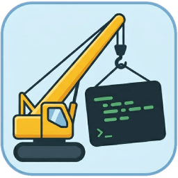
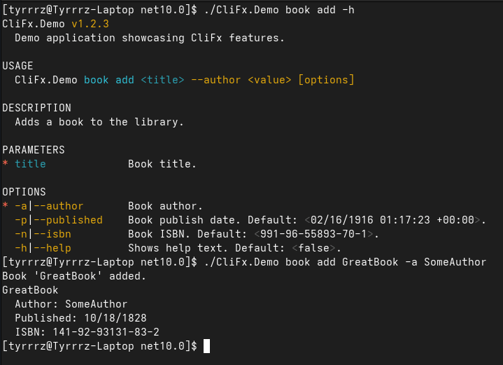

# CliFx

[](https://tyrrrz.me/ukraine)
[](https://github.com/Tyrrrz/CliFx/actions)
[](https://codecov.io/gh/Tyrrrz/CliFx)
[](https://nuget.org/packages/CliFx)
[](https://nuget.org/packages/CliFx)
[](https://discord.gg/2SUWKFnHSm)
[](https://tyrrrz.me/donate)
[](https://twitter.com/tyrrrz/status/1495972128977571848)

> 🟡 **Project status**: maintenance mode<sup>[[?]](https://github.com/Tyrrrz/.github/blob/master/docs/project-status.md)</sup>

<p align="center">
    
</p>

**CliFx** is a simple to use, yet powerful framework for building command-line applications.
Its primary goal is to completely take over the user input layer, allowing you to forget about infrastructural concerns and instead focus on writing your application.

## Terms of use<sup>[[?]](https://github.com/Tyrrrz/.github/blob/master/docs/why-so-political.md)</sup>

By using this project or its source code, for any purpose and in any shape or form, you grant your **implicit agreement** to all the following statements:

- You **condemn Russia and its military aggression against Ukraine**
- You **recognize that Russia is an occupant that unlawfully invaded a sovereign state**
- You **support Ukraine's territorial integrity, including its claims over temporarily occupied territories of Crimea and Donbas**
- You **reject false narratives perpetuated by Russian state propaganda**

To learn more about the war and how you can help, [click here](https://tyrrrz.me/ukraine). Glory to Ukraine! 🇺🇦

## Install

- 📦 [NuGet](https://nuget.org/packages/CliFx): `dotnet add package CliFx`

## Features

- Complete application framework, not just an argument parser
- Minimum boilerplate and easy to get started
- Class-first configuration via attributes
- Comprehensive auto-generated help text
- Support for deeply nested command hierarchies
- Graceful cancellation via interrupt signals
- Support for reading and writing binary data
- Testable console interaction layer
- Built-in analyzers to catch configuration issues
- Targets .NET Standard 2.0+
- No external dependencies

## Screenshots



## Usage

### Quick overview

To turn your program into a command-line interface, modify the `Main()` method so that it delegates the execution to an instance of `CliApplication`.
You can use `CliApplicationBuilder` to simplify the process of creating and configuring an application:

```csharp
using CliFx;

public static class Program
{
    public static async Task<int> Main() =>
        await new CliApplicationBuilder()
            .AddCommandsFromThisAssembly()
            .Build()
            .RunAsync();
}
```

> **Warning**:
> Ensure that your `Main()` method returns the integer exit code provided by `CliApplication.RunAsync()`, as shown in the above example.
> Exit code is used to communicate execution result to the parent process, so it's important that your program propagates it.

> **Note**:
> When calling `CliApplication.RunAsync()`, **CliFx** resolves command-line arguments and environment variables from `Environment.GetCommandLineArgs()` and `Environment.GetEnvironmentVariables()` respectively.
> You can also provide them manually using one of the alternative overloads.

The code above uses `AddCommandsFromThisAssembly()` to detect command types defined within the current project and register them on the application.
Commands are independent entry points, through which the user can interact with your program.

To define a command, create a class that implements the `ICommand` interface and annotate it with the `[Command]` attribute:

```csharp
using CliFx;
using CliFx.Attributes;

[Command(Description = "Calculates the logarithm of a value.")]
public class LogCommand : ICommand
{
    // Order: 0
    [CommandParameter(0, Description = "Value whose logarithm is to be found.")]
    public required double Value { get; init; }

    // Name: --base
    // Short name: -b
    [CommandOption("base", 'b', Description = "Logarithm base.")]
    public double Base { get; init; } = 10;

    public ValueTask ExecuteAsync(IConsole console)
    {
        var result = Math.Log(Value, Base);
        console.Output.WriteLine(result);

        // If the execution is not meant to be asynchronous,
        // return an empty task at the end of the method.
        return default;
    }
}
```

In order to implement `ICommand`, the class needs to define an `ExecuteAsync(...)` method.
This is the method that gets called by the framework when the user decides to execute the command.

As the only parameter, this method takes an instance of `IConsole`, which is an abstraction around the system console.
Use this abstraction in place of `System.Console` whenever you need to write output, read input, or otherwise interact with the console.

In most cases, you will also want to define input bindings, which are properties annotated by the `[CommandParameter]` and `[CommandOption]` attributes.
These bindings provide a way to map command-line arguments into structured input data that can be used by the command.

The command in the above example serves as a simple logarithm calculator and defines two inputs: a positional parameter for the input value and a named option for the logarithm base.
In order to execute this command, at minimum, the user needs to provide the input value:

```sh
$ dotnet myapp.dll 10000

4
```

They can also pass the `-b|--base` option to override the default logarithm base of `10`:

```sh
$ dotnet myapp.dll 729 -b 3

6
```

In case the user forgets to specify the required `value` parameter, the application will instead exit with an error:

```sh
$ dotnet myapp.dll -b 10

Missing required parameter(s):
<value>
```

Out of the box, **CliFx** also provides a built-in `--help` option, which generates a help screen that lists all parameters and options available for the command:

```sh
$ dotnet myapp.dll --help

MyApp v1.0

USAGE
  dotnet myapp.dll <value> [options]

DESCRIPTION
  Calculates the logarithm of a value.  

PARAMETERS
* value             Value whose logarithm is to be found.

OPTIONS
  -b|--base         Logarithm base. Default: "10".
  -h|--help         Shows help text.
  --version         Shows version information.
```

### Argument syntax

This library employs a variation of the POSIX argument syntax, which is used in most modern command-line tools.
Here are some examples of how it works:

- `myapp --foo bar` sets option `"foo"` to value `"bar"`
- `myapp -f bar` sets option `'f'` to value `"bar"`
- `myapp --switch` sets option `"switch"` without value
- `myapp -s` sets option `'s'` without value
- `myapp -abc` sets options `'a'`, `'b'` and `'c'` without value
- `myapp -xqf bar` sets options `'x'` and `'q'` without value, and option `'f'` to value `"bar"`
- `myapp -i file1.txt file2.txt` sets option `'i'` to a sequence of values `"file1.txt"` and `"file2.txt"`
- `myapp -i file1.txt -i file2.txt` sets option `'i'` to a sequence of values `"file1.txt"` and `"file2.txt"`
- `myapp cmd abc -o` routes to command `cmd` (assuming it's a command) with parameter `abc` and sets option `'o'` without value

Additionally, argument parsing in **CliFx** aims to be as deterministic as possible, ideally yielding the same result regardless of the application configuration.
In fact, the only context-sensitive part in the parser is the command name resolution, which needs to know the list of available commands in order to discern them from parameters.

The parser's context-free nature has several implications on how it consumes arguments.
For example, `myapp -i file1.txt file2.txt` will always be parsed as an option with multiple values, regardless of the arity of the underlying property it's bound to.
Similarly, unseparated arguments in the form of `myapp -ofile` will be treated as five distinct options `'o'`, `'f'`, `'i'`, `'l'`, `'e'`, instead of `'o'` being set to value `"file"`.

These rules also make the order of arguments important — command-line string is expected to follow this pattern:

```sh
$ myapp [...directives] [command] [...parameters] [...options]
```

### Parameters and options

**CliFx** supports two types of argument bindings: **parameters** and **options**.
Parameters are bound from the command-line arguments based on the order they appear in, while options are bound by their name.

Besides that, they also differ in the following ways:

- Parameters are required by default, while options are not.

  - You can make an option required by setting `IsRequired = true` on the corresponding attribute or by adding the `required` keyword to the property declaration (introduced in C# 11):

      ```csharp
      // Any option can be required or optional without restrictions
      [CommandOption("foo")]
      public required string RequiredOption { get; init; }
      ```

  - To make a parameter optional, you can set `IsRequired = false`, but only the last parameter (by order) can be configured in such way:

    ```csharp
    // Only the last parameter can be optional
    [CommandParameter(0, IsRequired = false)]
    public string? OptionalParameter { get; init; }
    ```

- Parameters are primarily used for scalar (non-enumerable) properties, while options can be used for both scalar and non-scalar properties.

  - You can bind an option to a property of a non-scalar type, such as `IReadOnlyList<T>`:

    ```csharp
    // Any option can be non-scalar
    [CommandOption("foo")]
    public required IReadOnlyList<string> NonScalarOption { get; init; }
    ```

  - You can bind a parameter to a non-scalar property, but only if it's the last parameter in the command:
  
    ```csharp
    // Only the last parameter can be non-scalar
    [CommandParameter(0)]
    public required IReadOnlyList<string> NonScalarParameter { get; init; }
    ```

- Options can rely on an environment variable for fallback, while parameters cannot:

  ```csharp
  // If the value is not provided directly, it will be read
  // from the environment variable instead.
  // This works for both scalar and non-scalar properties.
  [CommandOption("foo", EnvironmentVariable = "ENV_FOO")]
  public required string OptionWithFallback { get; init; }
  ```

> **Note**:
> **CliFx** has a set of built-in analyzers that detect common errors in command definitions.
> Your code will not compile if a command contains duplicate options, overlapping parameters, or otherwise invalid configuration.

### Value conversion

Parameters and options can be bound to properties with the following underlying types:

- Basic types
  - Primitive types (`int`, `bool`, `double`, `ulong`, `char`, etc.)
  - Date and time types (`DateTime`, `DateTimeOffset`, `TimeSpan`)
  - Enum types (converted from either name or numeric value)
- String-initializable types
  - Types with a constructor accepting a `string` (`FileInfo`, `DirectoryInfo`, etc.)
  - Types with a static `Parse(...)` method accepting a `string` and optionally a `IFormatProvider` (`Guid`, `BigInteger`, etc.)
- Nullable versions of all above types (`decimal?`, `TimeSpan?`, etc.)
- Any other type if a custom converter is specified
- Collections of all above types
  - Array types (`T[]`)
  - Types that are assignable from arrays (`IReadOnlyList<T>`, `ICollection<T>`, etc.)
  - Types with a constructor accepting an array (`List<T>`, `HashSet<T>`, etc.)

#### Non-scalar parameters and options

Here's an example of a command with an array-backed parameter:

```csharp
[Command]
public class FileSizeCalculatorCommand : ICommand
{
    // FileInfo is string-initializable and IReadOnlyList<T> can be assigned from an array,
    // so the value of this property can be mapped from a sequence of arguments.
    [CommandParameter(0)]
    public required IReadOnlyList<FileInfo> Files { get; init; }

    public ValueTask ExecuteAsync(IConsole console)
    {
        var totalSize = Files.Sum(f => f.Length);
        console.Output.WriteLine($"Total file size: {totalSize} bytes");

        return default;
    }
}
```

```sh
$ dotnet myapp.dll file1.bin file2.exe

Total file size: 186368 bytes
```

#### Custom conversion

To create a custom converter for a parameter or an option, define a class that inherits from `BindingConverter<T>` and specify it in the attribute:

```csharp
// Maps 2D vectors from AxB notation
public class VectorConverter : BindingConverter<Vector2>
{
    public override Vector2 Convert(string? rawValue)
    {
        if (string.IsNullOrWhiteSpace(rawValue))
            return default;

        var components = rawValue.Split('x', 'X', ';');
        var x = int.Parse(components[0], CultureInfo.InvariantCulture);
        var y = int.Parse(components[1], CultureInfo.InvariantCulture);

        return new Vector2(x, y);
    }
}

[Command]
public class SurfaceCalculatorCommand : ICommand
{
    // Custom converter is used to map raw argument values
    [CommandParameter(0, Converter = typeof(VectorConverter))]
    public required Vector2 PointA { get; init; }

    [CommandParameter(1, Converter = typeof(VectorConverter))]
    public required Vector2 PointB { get; init; }

    [CommandParameter(2, Converter = typeof(VectorConverter))]
    public required Vector2 PointC { get; init; }

    public ValueTask ExecuteAsync(IConsole console)
    {
        var a = (PointB - PointA).Length();
        var b = (PointC - PointB).Length();
        var c = (PointA - PointC).Length();

        var p = (a + b + c) / 2;
        var surface = Math.Sqrt(p * (p - a) * (p - b) * (p - c));

        console.Output.WriteLine($"Triangle surface area: {surface}");

        return default;
    }
}
```

```sh
$ dotnet myapp.dll 0x0 0x10 10x0

Triangle surface area: 50
```

### Multiple commands

In order to facilitate a variety of different workflows, command-line applications may provide the user with more than just a single command.
Complex applications may also nest commands underneath each other, employing a multi-level hierarchical structure.

With **CliFx**, this is achieved by simply giving each command a unique name through the `[Command]` attribute.
Commands that have common name segments are considered to be hierarchically related, which affects how they're listed in the help text.

```csharp
// Default command, i.e. command without a name
[Command]
public class DefaultCommand : ICommand
{
    // ...
}

// Child of default command
[Command("cmd1")]
public class FirstCommand : ICommand
{
    // ...
}

// Child of default command
[Command("cmd2")]
public class SecondCommand : ICommand
{
    // ...
}

// Child of FirstCommand
[Command("cmd1 sub")]
public class SubCommand : ICommand
{
    // ...
}
```

Once configured, the user can execute a specific command by prepending its name to the passed arguments.
For example, running `dotnet myapp.dll cmd1 arg1 -p 42` will execute `FirstCommand` in the above example.

The user can also find the list of all available top-level commands in the help text:

```sh
$ dotnet myapp.dll --help

MyApp v1.0

USAGE
  dotnet myapp.dll [options]
  dotnet myapp.dll [command] [...]

OPTIONS
  -h|--help         Shows help text.
  --version         Shows version information.

COMMANDS
  cmd1              Subcommands: cmd1 sub.
  cmd2

You can run `dotnet myapp.dll [command] --help` to show help on a specific command.
```

To see the list of commands nested under a specific command, the user can refine their help request by specifying the corresponding command name before the help option:

```sh
$ dotnet myapp.dll cmd1 --help

USAGE
  dotnet myapp.dll cmd1 [options]
  dotnet myapp.dll cmd1 [command] [...]

OPTIONS
  -h|--help         Shows help text.

COMMANDS
  sub

You can run `dotnet myapp.dll cmd1 [command] --help` to show help on a specific command.
```

> **Note**:
> Defining the default (unnamed) command is not required.
> If it's absent, running the application without specifying a command will just show the root-level help text.

### Reporting errors

Commands in **CliFx** do not directly return exit codes, but instead communicate execution errors via `CommandException`.
This special exception type can be used to print an error message to the console, return a specific exit code, and also optionally show help text for the current command:

```csharp
[Command]
public class DivideCommand : ICommand
{
    [CommandOption("dividend")]
    public required double Dividend { get; init; }

    [CommandOption("divisor")]
    public required double Divisor { get; init; }

    public ValueTask ExecuteAsync(IConsole console)
    {
        if (Math.Abs(Divisor) < double.Epsilon)
        {
            // This will print the error and set exit code to 133
            throw new CommandException("Division by zero is not supported.", 133);
        }

        var result = Dividend / Divisor;
        console.Output.WriteLine(result);

        return default;
    }
}
```

```sh
$ dotnet myapp.dll --dividend 10 --divisor 0

Division by zero is not supported.

$ echo $?

133
```

> **Warning**:
> Even though exit codes are represented by 32-bit integers in .NET, using values outside the 8-bit unsigned range will cause overflows on Unix systems.
> To avoid unexpected results, use numbers between 1 and 255 for exit codes that indicate failure.

### Graceful cancellation

Console applications support the concept of interrupt signals, which can be issued by the user to abort the currently ongoing operation.
If your command performs critical work, you can intercept these signals to handle cancellation requests in a graceful way.

In order to make the command cancellation-aware, call `console.RegisterCancellationHandler()` to register the signal handler and obtain the corresponding `CancellationToken`.
Once this method is called, the program will no longer terminate on an interrupt signal but will instead trigger the associated token, which can be used to delay the termination of a command just enough to exit in a controlled manner.

```csharp
[Command]
public class CancellableCommand : ICommand
{
    private async ValueTask DoSomethingAsync(CancellationToken cancellation)
    {
        await Task.Delay(TimeSpan.FromMinutes(10), cancellation);
    }

    public async ValueTask ExecuteAsync(IConsole console)
    {
        // Make the command cancellation-aware
        var cancellation = console.RegisterCancellationHandler();

        // Execute some long-running cancellable operation
        await DoSomethingAsync(cancellation);

        console.Output.WriteLine("Done.");
    }
}
```

> **Warning**:
> Cancellation handler is only respected when the user sends the interrupt signal for the first time.
> If the user decides to issue the signal again, the application will be forcefully terminated without triggering the cancellation token.

### Type activation

Because **CliFx** takes responsibility for the application's entire lifecycle, it needs to be capable of instantiating various user-defined types at run-time.
To facilitate that, it uses an interface called `ITypeActivator` that determines how to create a new instance of a given type.

The default implementation of `ITypeActivator` only supports types that have public parameterless constructors, which is sufficient for the majority of scenarios.
However, in some cases you may also want to define a custom initializer, for example when integrating with an external dependency container.

To do that, pass a custom `ITypeActivator` or a factory delegate to the `UseTypeActivator(...)` method when building the application:

```csharp
public static class Program
{
    public static async Task<int> Main() =>
        await new CliApplicationBuilder()
            .AddCommandsFromThisAssembly()
            .UseTypeActivator(type =>
            {
                var instance = MyTypeFactory.Create(type);
                return instance;
            })
            .Build()
            .RunAsync();
}
```

This method also supports `IServiceProvider` through various overloads, which allows you to directly integrate dependency containers that implement this interface. 
For example, this is how to configure your application to use [`Microsoft.Extensions.DependencyInjection`](https://nuget.org/packages/Microsoft.Extensions.DependencyInjection) as the type activator in **CliFx**:

```csharp
public static class Program
{
    public static async Task<int> Main() =>
        await new CliApplicationBuilder()
            .AddCommandsFromThisAssembly()
            .UseTypeActivator(commandTypes =>
            {
                var services = new ServiceCollection();

                // Register services
                services.AddSingleton<MyService>();

                // Register commands
                foreach (var commandType in commandTypes)
                    services.AddTransient(commandType);

                return services.BuildServiceProvider();
            })
            .Build()
            .RunAsync();
}
```

### Testing

Thanks to the `IConsole` abstraction, **CliFx** commands can be easily tested in isolation.
While an application running in production would rely on `SystemConsole` to interact with the real console, you can use `FakeConsole` and `FakeInMemoryConsole` in your tests to execute your commands in a simulated environment.

For example, imagine you have the following command:

```csharp
[Command]
public class ConcatCommand : ICommand
{
    [CommandOption("left")]
    public string Left { get; init; } = "Hello";

    [CommandOption("right")]
    public string Right { get; init; } = "world";

    public ValueTask ExecuteAsync(IConsole console)
    {
        console.Output.Write(Left);
        console.Output.Write(' ');
        console.Output.Write(Right);

        return default;
    }
}
```

To test it, you can instantiate the command in code with the required values, and then pass an instance of `FakeInMemoryConsole` to `ExecuteAsync(...)`:

```csharp
// Integration test at the command level
[Test]
public async Task ConcatCommand_executes_successfully()
{
    // Arrange
    using var console = new FakeInMemoryConsole();

    var command = new ConcatCommand
    {
        Left = "foo",
        Right = "bar"
    };

    // Act
    await command.ExecuteAsync(console);

    // Assert
    var stdOut = console.ReadOutputString();
    Assert.That(stdOut, Is.EqualTo("foo bar"));
}
```

Similarly, you can also test your command at a higher level like so:

```csharp
// End-to-end test at the application level
[Test]
public async Task ConcatCommand_executes_successfully()
{
    // Arrange
    using var console = new FakeInMemoryConsole();

    var app = new CliApplicationBuilder()
        .AddCommand<ConcatCommand>()
        .UseConsole(console)
        .Build();

    var args = new[]
    {
        "--left", "foo",
        "--right", "bar"
    };

    var envVars = new Dictionary<string, string>();

    // Act
    await app.RunAsync(args, envVars);

    // Assert
    var stdOut = console.ReadOutputString();
    Assert.That(stdOut, Is.EqualTo("foo bar"));
}
```

### Debug and preview mode

When troubleshooting issues, you may find it useful to run your app in debug or preview mode.
To do that, pass the corresponding directive before any other command-line arguments.

In order to run the application in debug mode, use the `[debug]` directive.
This will cause the program to launch in a suspended state, waiting for the debugger to attach to the current process:

```sh
$ dotnet myapp.dll [debug] cmd -o

Attach debugger to PID 3148 to continue.
```

To run the application in preview mode, use the `[preview]` directive.
This will short-circuit the execution and instead print the consumed command-line arguments as they were parsed, along with resolved environment variables:

```sh
$ dotnet myapp.dll [preview] cmd arg1 arg2 -o foo --option bar1 bar2

Command-line:
  cmd <arg1> <arg2> [-o foo] [--option bar1 bar2]

Environment:
  FOO="123"
  BAR="xyz"
```

You can also disallow these directives, e.g. when running in production, by calling `AllowDebugMode(...)` and `AllowPreviewMode(...)` methods on `CliApplicationBuilder`:

```csharp
var app = new CliApplicationBuilder()
    .AddCommandsFromThisAssembly()
    .AllowDebugMode(true) // allow debug mode
    .AllowPreviewMode(false) // disallow preview mode
    .Build();
```

## Etymology

**CliFx** is made out of "Cli" for "Command-line Interface" and "Fx" for "Framework".
It's pronounced as "cliff ex".