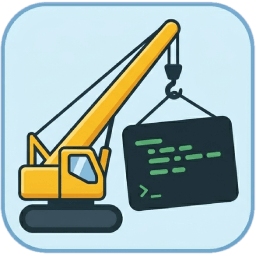
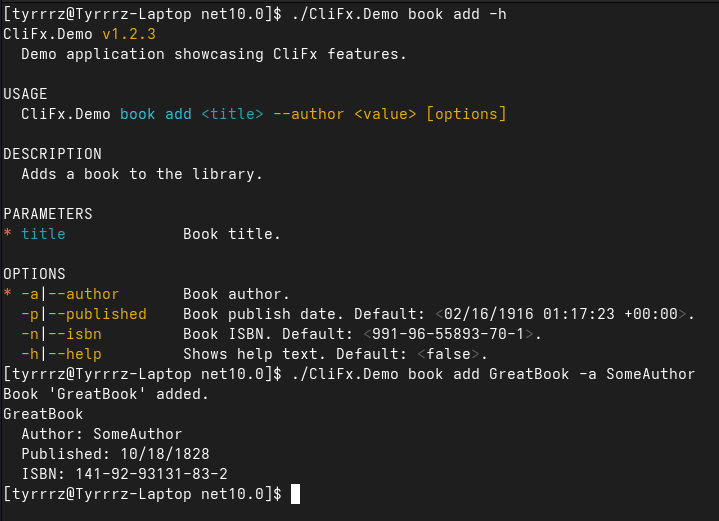

# CliFx

[](https://github.com/Tyrrrz/.github/blob/prime/docs/project-status.md)
[](https://tyrrrz.me/ukraine)
[](https://github.com/Tyrrrz/CliFx/actions)
[](https://codecov.io/gh/Tyrrrz/CliFx)
[](https://nuget.org/packages/CliFx)
[](https://nuget.org/packages/CliFx)
[](https://discord.gg/2SUWKFnHSm)
[](https://twitter.com/tyrrrz/status/1495972128977571848)

<table>
    <tr>
        <td width="99999" align="center">Development of this project is entirely funded by the community. <b><a href="https://tyrrrz.me/donate">Consider donating to support!</a></b></td>
    </tr>
</table>

<p align="center">
    
</p>

**CliFx** is an opinionated framework for building command-line applications.
It provides a model for expressing command interactions through classes and properties, skipping all the low-level infrastructure concerns like argument parsing, routing, error handling, and help generation.

## Terms of use<sup>[[?]](https://github.com/Tyrrrz/.github/blob/prime/docs/why-so-political.md)</sup>

By using this project or its source code, for any purpose and in any shape or form, you grant your **implicit agreement** to all the following statements:

- You **condemn Russia and its military aggression against Ukraine**
- You **recognize that Russia is an occupant that unlawfully invaded a sovereign state**
- You **support Ukraine's territorial integrity, including its claims over temporarily occupied territories of Crimea and Donbas**
- You **reject false narratives perpetuated by Russian state propaganda**

To learn more about the war and how you can help, [click here](https://tyrrrz.me/ukraine). Glory to Ukraine! 🇺🇦

## Install

- 📦 [NuGet](https://nuget.org/packages/CliFx): `dotnet add package CliFx`

## Features

- Complete application framework, not just an argument parser
- Minimal boilerplate and easy to get started
- Class-first configuration via attributes
- Comprehensive auto-generated help text
- Support for deeply nested command hierarchies
- Graceful cancellation via interrupt signals
- Support for reading and writing binary data
- Testable console interaction layer
- Compatible with Native AOT and trimming
- Targets .NET Standard 2.0+
- No external dependencies

## Screenshots



## Usage

### Quick overview

In **CliFx**, all application functionality is encapsulated within commands — they represent different independent entry points that the user can execute.
To define a command, declare a `partial` type, annotate it with the `[Command]` attribute, and implement the `ICommand` interface:

```csharp
using CliFx;
using CliFx.Binding;
using CliFx.Infrastructure;

// Default command (no name specified)
[Command(Description = "Calculates the logarithm of a value.")]
public partial class LogCommand : ICommand
{
    // Order: 0
    [CommandParameter(0, Description = "Value whose logarithm is to be found.")]
    public required double Value { get; set; }

    // Name: --base
    // Short name: -b
    [CommandOption("base", 'b', Description = "Logarithm base.")]
    public double Base { get; set; } = 10;

    public ValueTask ExecuteAsync(IConsole console)
    {
        var result = Math.Log(Value, Base);
        console.WriteLine(result);

        // This method supports asynchronous execution.
        // If you don't have any asynchronous work to do, just return
        // the default value, which is a completed ValueTask.
        return default;
    }
}
```

> [!IMPORTANT]
> The command type must be declared as `partial` so that **CliFx** can extend it with necessary metadata and behavior.
> If the type is nested within other types, all of them must also be marked as `partial`.

The `ICommand` interface requires the type to define an `ExecuteAsync(...)` method, which contains the command's execution logic.
As the only parameter, this method takes an instance of `IConsole` — a decoupled abstraction used in place of `System.Console` to write text, read binary data, or otherwise interact with the console.

Beyond that, your command will probably also need to receive some input from the user.
This is achieved by defining properties and attaching the `[CommandParameter]` and `[CommandOption]` attributes to bind them as either parameters or options.

The command in the above example serves as a simple logarithm calculator that has two inputs: a positional parameter for the logarithm value (bound to `Value`) and a named option for the logarithm base (bound to `Base`).
Its command-line signature looks like this:

```console
$ ./myapp <value> [--base <base>]
```

Beyond that, no additional setup is required — **CliFx** uses source generators to discover commands and produce the `Main()` method automatically.
If you wish to customize the application further, you can provide your own `Main()` method as described in the [application configuration](#application-configuration) section.

Now, the user can execute `LogCommand` by running the application and passing an argument to the `value` parameter:

```console
$ ./myapp 10000

4
```

They can also use the `-b|--base` option to override the default logarithm base of `10`:

```console
$ ./myapp 729 -b 3

6
```

In case the user forgets to specify the required `value` parameter, the application will instead exit with an error:

```console
$ ./myapp -b 10

Missing required parameter(s):
<value>
```

**CliFx** also automatically binds the conventional `-h|--help` option.
It can be used to request a help screen that lists all available options and parameters, their descriptions, and usage examples:

```console
$ ./myapp --help

MyApp v1.0

USAGE
  myapp <value> [options]

DESCRIPTION
  Calculates the logarithm of a value.

PARAMETERS
* value             Value whose logarithm is to be found.

OPTIONS
  -b|--base         Logarithm base. Default: <10>.
  -h|--help         Shows help text. Default: <false>.
  --version         Shows version information. Default: <false>.
```

Because `LogCommand` doesn't have a name, it's treated as the default (i.e. root) command, which is executed when the user doesn't specify any command name in the arguments.
More complex applications typically employ several commands, each with its own name and functionality, allowing the user to choose between different workflows.

To define a named command, simply specify its name in the `[Command]` attribute:

```csharp
[Command("log", Description = "Calculates the logarithm of a value.")]
public partial class LogCommand : ICommand
{
    // Same code as before
}

[Command("sum", Description = "Calculates the sum of all input values.")]
public partial class SumCommand : ICommand
{
    [CommandParameter(0, Description = "Values to be summed.")]
    public required IReadOnlyList<double> Values { get; set; }

    public ValueTask ExecuteAsync(IConsole console)
    {
        var result = Values.Sum();
        console.WriteLine(result);

        return default;
    }
}
```

The setup above binds the original logarithm command as `log` and also introduces a new `sum` command that calculates the sum of all input values.
This allows the user to run the application in one of the two following ways:

```console
$ ./myapp log 100 -b 10

2

$ ./myapp sum 1 2 3

6
```

Also, if the user now requests root-level help, they will see both commands included in the output:

```console
$ ./myapp --help

MyApp v1.0

USAGE
  myapp [options]
  myapp [command] ...

OPTIONS
  -h|--help         Shows help text. Default: <false>.
  --version         Shows version information. Default: <false>.

COMMANDS
  log               Calculates the logarithm of a value.
  sum               Calculates the sum of all input values.

You can run `myapp [command] --help` to show help for a specific command.
```

### Input bindings

**CliFx** supports two types of input bindings: **parameters** and **options**.
Parameters are bound from the command-line arguments based on the order they appear in, while options are bound by their name.

These two kinds of bindings are configured through the `[CommandParameter]` and `[CommandOption]` attributes respectively, which can be applied to any property on the command type.
Despite both fulfilling the same purpose of mapping command-line inputs to properties, parameters and options have somewhat different semantics and usage patterns.

#### Parameters

Below is an example of a simple parameter binding:

```csharp
// Order: 0
[CommandParameter(0)]
public required double Param { get; set; }

// Usage:
// $ ./myapp <param>
```

> [!IMPORTANT]
> Order values must be unique among the parameters of the same command.

As evident from the attribute, this parameter is bound with the order of `0`.
This value specifies the parameter's position relative to the other parameters in the command, determining the order in which it is activated from the command line.

For example, given the following bindings, parameters will receive their inputs in the order of: `First` -> `Second` -> `Third`:

```csharp
[CommandParameter(1)]
public required string Second { get; set; }

[CommandParameter(0)]
public required string First { get; set; }

[CommandParameter(2)]
public required string Third { get; set; }

// Usage:
// $ ./myapp <first> <second> <third>
```

Because parameters are bound positionally, every subsequent parameter relies on the previous one to be set in order to itself receive a value.
This makes them primarily suited for handling mandatory inputs, hence why the underlying properties in the above examples are all marked as `required`.

If you do need to bind a non-required parameter, you can do so by dropping the `required` modifier from the property — however this can only be done for the last parameter in the command:

```csharp
[CommandParameter(0)]
public required string First { get; set; }

[CommandParameter(1)]
public required string Second { get; set; }

// This parameter is not required (value can be omitted).
// Only one parameter can be non-required, and it has to be the last one by order.
[CommandParameter(2)]
public string? Third { get; set; }

// Usage:
// $ ./myapp <first> <second> [<third>]
```

Due to the same positional nature, parameters generally cannot be used for inputs that take more than one value, as it's not always clear how many arguments should be consumed for a given parameter.
The only exception to that rule is, again, when the parameter is the last one in the command:

```csharp
[CommandParameter(0)]
public required string First { get; set; }

[CommandParameter(1)]
public required string Second { get; set; }

// This parameter is sequence-based (can take multiple values).
// Only one parameter can be sequence-based, and it has to be the last one by order.
[CommandParameter(2)]
public required IReadOnlyList<string> Third { get; set; }

// Usage:
// $ ./myapp <first> <second> <third...>
```

Besides that, when binding properties to parameters, you can also specify a custom name and description.
These don't have any functional implications, but are used to identify the parameter in the help text:

```csharp
[CommandParameter(0,
    // These properties are optional and only dictate how the parameter
    // is identified in the auto-generated help text.
    Name = "logval",
    Description = "Value whose logarithm is to be found."
)]
public required double Value { get; set; }

// Usage:
// $ ./myapp <logval>
```

> [!IMPORTANT]
> Parameter names must be unique among the parameters of the same command.

As a general guideline, prefer using parameter bindings for inputs that:

- Are essential for the command to execute successfully
- Don't have an obvious default value
- Are scalar and don't take multiple values

#### Options

Below is an example of a simple option binding:

```csharp
[CommandOption("opt", 'o')]
public double Option { get; set; }

// Usage:
// $ ./myapp [--opt <value>]
// $ ./myapp [-o <value>]
```

> [!IMPORTANT]
> Option names and short names must be unique among the options of the same command.
> The comparison is case-insensitive for names and case-sensitive for short names.

> [!NOTE]
> An option binding doesn't have to specify both a name and a short name, but at least one of them needs to be set.

As evident from the attribute, this option is bound with the name of `opt` and a short name of `o`.
The user can pass the option by specifying either of these identifiers, and **CliFx** will set the provided value to the corresponding property.

If an option is essential to the execution of the command, the underlying property can also be marked as `required`.
This will make it so that the user has to provide a value for this option on every execution of the command, otherwise the application will exit with an error.

Unlike the parameters, though, options can be marked as required and non-required arbitrarily, without any restrictions:

```csharp
// This option is required (value must be provided by the user)
[CommandOption("foo")]
public required string Foo { get; set; }

// This option is not required (value can be omitted)
[CommandOption("bar")]
public string? Bar { get; set; }

// This option is also required
[CommandOption("baz")]
public required string Baz { get; set; }

// Usage:
// $ ./myapp --foo <value> [--bar <value>] --baz <value>
```

In the same vein, options can be freely used for inputs that take multiple values:

```csharp
// This option is sequence-based (can take multiple values)
[CommandOption("foo")]
public required IReadOnlyList<string> Foo { get; set; }

// This option is also sequence-based
[CommandOption("bar")]
public required IReadOnlyList<string> Bar { get; set; }

// Usage:
// $ ./myapp --foo <value...> --bar <value...>
```

Finally, options can also be configured to rely on an environment variable for fallback, which is useful for required inputs that the user may not want to specify every time:

```csharp
// If the value is not provided from the command line, it will be read
// from the "ENV_FOO" environment variable instead.
[CommandOption("foo", EnvironmentVariable = "ENV_FOO")]
public required string Foo { get; set; }

// Usage:
// $ ./myapp --foo <value>
// Example:
// $ ./myapp --foo bar
// $ ENV_FOO=bar ./myapp
```

> [!NOTE]
> If the user provides a value for an option while the fallback environment variable is also set, the command-line input will take precedence.

As a general guideline, prefer using option bindings for inputs that:

- Enable an alternative execution path in the command
- Have an obvious and sensible default value
- Otherwise can't be easily expressed as parameters

#### Conversion

**CliFx** employs the `IInputConverter<T>` interface to handle input conversion between raw command-line arguments (strings) and the underlying properties.
By default, the framework will try to automatically infer a suitable converter for each property based on its type, supporting the following scenarios:

- `string`
  - No conversion required
- `bool`
  - Converted by calling `bool.Parse(...)`
  - Converted as `true` if passed nothing (e.g. `--switch`)
- `enum`
  - Converted by calling `Enum.ToObject(...)` if passed a numeric string
  - Converted by calling `Enum.Parse(...)` if passed a non-numeric string
- Any type that implements a `static T Parse(string, IFormatProvider?)` method
  - The `IFormatProvider?` parameter is optional
  - Converted by calling `T.Parse(...)`
  - Covers a wide range of built-in .NET types, such as `int`, `double`, `DateTime`, `Guid`, etc.
  - Also supports user-defined types that implement the corresponding method
- Any type that implements a `.ctor(string)` constructor
  - Converted by calling `.ctor(...)`
  - Covers types that don't have a `Parse(...)` method but can still be initialized from a string, such as `FileInfo`, `DirectoryInfo`, etc.
  - Also supports user-defined types that implement the corresponding constructor
- `Nullable<T>` of the above value types
  - Converted by invoking the underlying conversion logic for `T`
  - Converted as `null` if passed nothing
- `T[]` of the above types
  - Converted by invoking the underlying conversion logic for `T` for each passed argument
  - Also works for interfaces assignable from arrays, such as `IEnumerable<T>`, `IReadOnlyList<T>`, `IReadOnlyCollection<T>`, etc.
- Any type that implements a `.ctor(T[])` constructor
  - Converted by calling `.ctor(...)` with the array of converted values
  - Covers collection types like `List<T>`, `HashSet<T>`, etc.

For example, here is a command that showcases some of these built-in conversions:

```csharp
[Command("search", Description = "Searches for files matching a pattern.")]
public partial class SearchCommand : ICommand
{
    [CommandParameter(0, Description = "Pattern to search for.")]
    public required string Pattern { get; set; }

    [CommandOption("recursive", 'r', Description = "Whether to search subdirectories.")]
    public bool Recursive { get; set; }

    public enum OutputFormat { Plain, Json, Xml }

    [CommandOption("format", 'f', Description = "Output format.")]
    public OutputFormat Format { get; set; } = OutputFormat.Plain;

    [CommandOption("in", Description = "Directories to search in.")]
    public IReadOnlyList<DirectoryInfo> Paths { get; set; } = [];

    public ValueTask ExecuteAsync(IConsole console)
    {
        // ...
    }
}

// Usage
// $ ./myapp search <pattern> [--recursive] [--format <value>] [--in <value...>]
// Example:
// $ ./myapp search "*.log" --recursive --format json --in /var/log /tmp/logs
```

If you need to support a type that isn't covered by the default conversion logic, you can also implement a custom converter yourself.
To do that, create a class that implements `IInputConverter<T>` by deriving from either `ScalarInputConverter<T>` for scalar types or `SequenceInputConverter<T>` for sequence-based types:

```csharp
using CliFx.Activation;

// Maps 2D vectors from AxB notation
public class VectorConverter
    // ScalarInputConverter<T> for single-value inputs
    // SequenceInputConverter<T> for multiple-value inputs
    : ScalarInputConverter<Vector2>
{
    public override Vector2 Convert(string? rawValue)
    {
        if (string.IsNullOrWhiteSpace(rawValue))
            return default;

        var components = rawValue.Split('x', 'X', ';');
        var x = int.Parse(components[0], CultureInfo.InvariantCulture);
        var y = int.Parse(components[1], CultureInfo.InvariantCulture);

        return new Vector2(x, y);
    }
}
```

> [!IMPORTANT]
> Custom converter types must have a public parameter-less constructor, which is used by the framework to instantiate them at run time.

Then, specify this converter in the `Converter` property of the binding attribute:

```csharp
[Command("surface", Description = "Calculates the surface area of a triangle defined by three points.")]
public partial class SurfaceCalculatorCommand : ICommand
{
    [CommandParameter(
        0,
        Description = "First point of the triangle, in the format AxB (e.g. 10x20).",
        Converter = typeof(VectorConverter)
    )]
    public required Vector2 PointA { get; set; }

    [CommandParameter(
        1,
        Description = "Second point of the triangle, in the format AxB (e.g. 10x20).",
        Converter = typeof(VectorConverter)
    )]
    public required Vector2 PointB { get; set; }

    [CommandParameter(
        2,
        Description = "Third point of the triangle, in the format AxB (e.g. 10x20).",
        Converter = typeof(VectorConverter)
    )]
    public required Vector2 PointC { get; set; }

    public ValueTask ExecuteAsync(IConsole console)
    {
        // ...
    }
}

// Usage:
// $ ./myapp surface <pointA> <pointB> <pointC>
// Example:
// $ ./myapp surface 0x0 0x10 10x0
```

#### Validation

Besides custom converters, you can also implement custom validators to verify that your inputs meet certain criteria before the command is executed.
Unlike converters, validators work with already converted values rather than raw command-line arguments.

To implement a custom validator, create a class that implements `IInputValidator<T>` by deriving from `InputValidator<T>`:

```csharp
using CliFx.Activation;

public class PositiveNumberValidator : InputValidator<double>
{
    public override IEnumerable<InputValidationError> Validate(double value)
    {
        if (value <= 0)
            yield return Error("Value must be positive.");
    }
}
```

> [!IMPORTANT]
> Custom validator types must have a public parameter-less constructor, which is used by the framework to instantiate them at run time.

Then, include this validator in the `Validators` property of the binding attribute:

```csharp
[Command("sqrt", Description = "Calculates the square root of a value.")]
public partial class SqrtCommand : ICommand
{
    [CommandParameter(
        0,
        Description = "Value whose square root is to be found.",
        Validators = [typeof(PositiveNumberValidator)]
    )]
    public required double Value { get; set; }

    public ValueTask ExecuteAsync(IConsole console)
    {
        // ...
    }
}

// Usage:
// $ ./myapp sqrt <value>
// Example:
// $ ./myapp sqrt 25
```

The `Validators` property is an array, so you can specify more than one validator for the same input.
When using multiple validators, all of them will be executed sequentially and their errors will be merged and reported together:

```csharp
[Command("passwd", Description = "Changes the user password.")]
public partial class ChangePasswordCommand : ICommand
{
    [CommandParameter(0, Description = "Username whose password is to be changed.")]
    public required string Username { get; set; }

    [CommandParameter(
        1,
        Description = "New password.",
        Validators =
        [
            typeof(PasswordLengthValidator),
            typeof(PasswordComplexityValidator)
        ]
    )]
    public required string Password { get; set; }

    public ValueTask ExecuteAsync(IConsole console)
    {
        // ...
    }
}

// Usage:
// $ ./myapp passwd <username> <password>
// Example:
// $ ./myapp passwd alice "verystr0ngpassw0rd!"
```

#### Argument syntax

**CliFx** employs a variation of the POSIX argument syntax, which is used in most modern command-line tools.
Here are some examples of how it works:

- `./myapp --foo bar` sets the option `"foo"` to value `"bar"`
- `./myapp -f bar` sets the option `'f'` to value `"bar"`
- `./myapp --switch` sets the option `"switch"` without a value
- `./myapp -s` sets the option `'s'` without a value
- `./myapp -abc` sets the options `'a'`, `'b'` and `'c'` without values
- `./myapp -xqf bar` sets the options `'x'` and `'q'` without values, and the option `'f'` to value `"bar"`
- `./myapp -i file1.txt file2.txt` sets option `'i'` to a sequence of values `"file1.txt"` and `"file2.txt"`
- `./myapp -i file1.txt -i file2.txt` sets option `'i'` to a sequence of values `"file1.txt"` and `"file2.txt"`
- `./myapp cmd abc -o` routes to command `cmd` (assuming it's a command) with parameter `abc` and sets option `'o'` without value

Additionally, argument parsing in **CliFx** aims to be as deterministic as possible, ideally yielding the same result regardless of the application configuration.
In fact, the only context-sensitive part in the parser is the command name resolution, which needs to know the list of available commands in order to discern them from parameters.

The parser's context-free nature has several implications on how it consumes arguments.
For example, `./myapp -i file1.txt file2.txt` will always be parsed as an option with multiple values, regardless of the arity of the underlying property it's bound to.
Similarly, unseparated arguments in the form of `./myapp -ofile` will be treated as five distinct options `'o'`, `'f'`, `'i'`, `'l'`, `'e'`, instead of `'o'` being set to value `"file"`.

These rules also make the order of arguments important — the command-line string is expected to follow this pattern:

```console
$ ./myapp [command] [...parameters] [...options]
```

### Command routing

Command-line applications often provide the user with more than just a single command, facilitating a variety of different workflows.
Complex applications may also nest commands within each other, employing a multi-level hierarchical structure.

With **CliFx**, this is achieved by simply giving each command a unique name through the `[Command]` attribute.
Commands that have common name segments are considered to be hierarchically related, affecting how they appear in the help text:

```csharp
// Default command, i.e. command without a name
[Command]
public partial class DefaultCommand : ICommand
{
    // ...
}

// Child of the default command
[Command("cmd1")]
public partial class FirstCommand : ICommand
{
    // ...
}

// Another child of the default command
[Command("cmd2")]
public partial class SecondCommand : ICommand
{
    // ...
}

// Child of cmd1 (FirstCommand)
[Command("cmd1 sub")]
public partial class SubCommand : ICommand
{
    // ...
}
```

Once configured, the user can execute a specific command by prepending its name to the passed arguments.
For example, to execute `FirstCommand` with a parameter and an option, the user can run:

```console
$ ./myapp cmd1 arg1 -p 42
```

The user can also find the list of all available top-level commands in the help text:

```console
$ ./myapp --help

MyApp v1.0

USAGE
  myapp [options]
  myapp [command] ...

OPTIONS
  -h|--help         Shows help text. Default: <false>.
  --version         Shows version information. Default: <false>.

COMMANDS
  cmd1              Subcommands: cmd1 sub.
  cmd2

You can run `myapp [command] --help` to show help for a specific command.
```

To see the list of commands nested under a specific command, the user can refine their help request by specifying the corresponding command name before the help option:

```console
$ ./myapp cmd1 --help

USAGE
  myapp cmd1 [options]
  myapp cmd1 [command] ...

OPTIONS
  -h|--help         Shows help text. Default: <false>.

COMMANDS
  sub

You can run `myapp cmd1 [command] --help` to show help for a specific command.
```

> [!NOTE]
> Defining the default (unnamed) command is not required.
> If it's absent, **CliFx** will generate one for you automatically.

### Error reporting

Commands in **CliFx** do not directly return exit codes, but instead communicate execution errors via `CommandException`.
This special exception type can be used to print an error message to the console, return a specific exit code, and also optionally show help text for the current command:

```csharp
[Command("div")]
public partial class DivideCommand : ICommand
{
    [CommandOption("dividend")]
    public required double Dividend { get; set; }

    [CommandOption("divisor")]
    public required double Divisor { get; set; }

    public ValueTask ExecuteAsync(IConsole console)
    {
        if (Math.Abs(Divisor) < double.Epsilon)
        {
            // This will print the error and set exit code to 133
            throw new CommandException("Division by zero is not supported.", 133);
        }

        var result = Dividend / Divisor;
        console.Output.WriteLine(result);

        return default;
    }
}
```

```console
$ ./myapp div --dividend 10 --divisor 0

Division by zero is not supported.

$ echo $?

133
```

> [!WARNING]
> Even though exit codes are represented by 32-bit integers in .NET, using values outside the 8-bit unsigned range will cause overflows on Unix systems.
> To avoid unexpected results, use numbers between 1 and 255 for exit codes that indicate failure.

### Graceful cancellation

Console applications support the concept of interrupt signals, which can be issued by the user to abort the currently ongoing operation.
If your command performs critical work, you can intercept these signals to handle cancellation requests in a graceful way.

You can make a command cancellation-aware by calling `console.RegisterCancellationHandler()`, which registers the signal handler and returns the corresponding `CancellationToken`.
Once this method is called, the program will no longer terminate on an interrupt signal but will instead trigger the associated token, which can be used to delay the termination of a command enough to exit in a controlled manner:

```csharp
[Command]
public partial class CancellableCommand : ICommand
{
    private async ValueTask DoSomethingAsync(CancellationToken cancellation)
    {
        await Task.Delay(TimeSpan.FromMinutes(10), cancellation);
    }

    public async ValueTask ExecuteAsync(IConsole console)
    {
        // Make the command cancellation-aware
        var cancellation = console.RegisterCancellationHandler();

        // Execute some long-running cancellable operation
        await DoSomethingAsync(cancellation);

        console.Output.WriteLine("Done.");
    }
}
```

> [!WARNING]
> Cancellation handler is only respected when the user sends the interrupt signal for the first time.
> If the user decides to issue the signal again, the application will be forcefully terminated without triggering the cancellation token.

### Testing

Thanks to the `IConsole` abstraction, **CliFx** commands can be easily tested in isolation.
While an application running in production would rely on `SystemConsole` to interact with the real console, you can use `FakeConsole` and `FakeInMemoryConsole` in your tests to execute your commands in a simulated environment.

For example, imagine you have the following command:

```csharp
[Command("concat")]
public partial class ConcatCommand : ICommand
{
    [CommandOption("left")]
    public string Left { get; set; } = "Hello";

    [CommandOption("right")]
    public string Right { get; set; } = "world";

    public ValueTask ExecuteAsync(IConsole console)
    {
        console.Output.Write(Left);
        console.Output.Write(' ');
        console.Output.Write(Right);

        return default;
    }
}
```

To test it, you can instantiate the command in code with the required values, and then pass an instance of `FakeInMemoryConsole` to `ExecuteAsync(...)`:

```csharp
// Integration test at the command level
[Test]
public async Task ConcatCommand_executes_successfully()
{
    // Arrange
    using var console = new FakeInMemoryConsole();

    var command = new ConcatCommand
    {
        Left = "foo",
        Right = "bar"
    };

    // Act
    await command.ExecuteAsync(console);

    // Assert
    var stdOut = console.ReadOutputString();
    Assert.That(stdOut, Is.EqualTo("foo bar"));
}
```

Similarly, you can also test your command at a higher level like so:

```csharp
// End-to-end test at the application level
[Test]
public async Task ConcatCommand_executes_successfully()
{
    // Arrange
    using var console = new FakeInMemoryConsole();

    var app = new CommandLineApplicationBuilder()
        .AddCommand(ConcatCommand.Descriptor)
        .UseConsole(console)
        .Build();

    var args = new[]
    {
        "concat",
        "--left", "foo",
        "--right", "bar"
    };

    var envVars = new Dictionary<string, string>();

    // Act
    await app.RunAsync(args, envVars);

    // Assert
    var stdOut = console.ReadOutputString();
    Assert.That(stdOut, Is.EqualTo("foo bar"));
}
```

### Application configuration

As mentioned earlier, **CliFx** automatically generates a `Main()` method that builds and runs the application using all commands discovered in the current assembly.
If you need to customize this behavior, you can provide your own `Main()` method and use the `CommandLineApplicationBuilder` helper to configure the application:

```csharp
using CliFx;

public static class Program
{
    public static async Task<int> Main() =>
        await new CommandLineApplicationBuilder()
            .AddCommandsFromThisAssembly()
            .SetTitle("My App")
            .SetVersion("1.0.0")
            .Build()
            .RunAsync();
}
```

> [!IMPORTANT]
> Ensure that your `Main()` method returns the integer exit code provided by `CommandLineApplication.RunAsync()`, as shown in the example.
> Exit code is used to communicate execution result to the parent process, so it's important that your program properly propagates it.

By default, `CommandLineApplication.RunAsync()` resolves command-line arguments and environment variables from `Environment.GetCommandLineArgs()` and `Environment.GetEnvironmentVariables()` respectively, but you can also provide them explicitly using one of the other available overloads.

Here is the full list of configuration methods available on `CommandLineApplicationBuilder`:

- `AddCommand(...)` / `AddCommands(...)` — registers one or more commands with the application. Alternatively, `AddCommandsFromThisAssembly()` detects and registers all accessible commands from the current assembly.
- `SetTitle(...)` — sets the application title displayed in the help text. Defaults to the assembly name.
- `SetExecutableName(...)` — sets the executable name displayed in the help text. Defaults to the assembly file name.
- `SetVersion(...)` — sets the version displayed in the help text and when version info is requested. Defaults to the assembly version.
- `SetDescription(...)` — sets the application description displayed in the help text.
- `UseConsole(...)` — provides a custom `IConsole` implementation, useful for [testing](#testing).
- `UseTypeInstantiator(...)` — provides a custom type instantiator for creating command instances. See [dependency injection](#dependency-injection).
- `AllowDebugMode(...)` / `AllowPreviewMode(...)` — enables diagnostic modes. See [debug and preview mode](#debug-and-preview-mode).

#### Dependency injection

Because **CliFx** takes responsibility for the application's entire lifecycle, it needs to be capable of instantiating commands at run time.
By default, only types with public parameter-less constructors are supported, which is sufficient for most common scenarios.

However, in some cases you may want to integrate with an external dependency container.
This can be done by passing a custom `ITypeInstantiator` or a factory delegate to `UseTypeInstantiator(...)`:

```csharp
public static class Program
{
    public static async Task<int> Main() =>
        await new CommandLineApplicationBuilder()
            .AddCommandsFromThisAssembly()
            .UseTypeInstantiator(type =>
            {
                var instance = MyTypeFactory.Create(type);
                return instance;
            })
            .Build()
            .RunAsync();
}
```

This method also supports `IServiceProvider` through various overloads, which allows you to directly integrate dependency containers that implement this interface.
For example, this is how to configure your application to use [`Microsoft.Extensions.DependencyInjection`](https://nuget.org/packages/Microsoft.Extensions.DependencyInjection) as the type instantiator in **CliFx**:

```csharp
public static class Program
{
    public static async Task<int> Main() =>
        await new CommandLineApplicationBuilder()
            .AddCommandsFromThisAssembly()
            .UseTypeInstantiator(commands =>
            {
                var services = new ServiceCollection();

                // Register services
                services.AddSingleton<MyService>();

                // Register commands
                foreach (var command in commands)
                    services.AddTransient(command.Type);

                return services.BuildServiceProvider();
            })
            .Build()
            .RunAsync();
}
```

> [!NOTE]
> If you want to use certain advanced features provided by `Microsoft.Extensions.DependencyInjection`, you may need to do a bit of extra work to configure the container properly.
> For example, to leverage support for keyed services, you need to [manually register an implementation of `IKeyedServiceProvider`](https://github.com/Tyrrrz/CliFx/issues/148).

#### Debug and preview mode

When troubleshooting issues, you may find it useful to run your application in debug or preview mode.
These modes are activated through environment variables, which you can configure using `AllowDebugMode(...)` and `AllowPreviewMode(...)`:

```csharp
public static async Task<int> Main() =>
    await new CommandLineApplicationBuilder()
        .AddCommandsFromThisAssembly()
        .AllowDebugMode("CLIFX_DEBUG")
        .AllowPreviewMode("CLIFX_PREVIEW")
        .Build()
        .RunAsync();
```

> [!TIP]
> Calling `AllowDebugMode()` and `AllowPreviewMode()` without arguments will enable these modes with the default environment variable names of `CLIFX_DEBUG` and `CLIFX_PREVIEW` respectively.

When the debug mode environment variable is set to `true`, the application will launch in a suspended state, waiting for a debugger to attach to the current process:

```console
$ CLIFX_DEBUG=true ./myapp cmd -o

Attach a debugger to the process with ID 3148 to continue.
```

When the preview mode environment variable is set to `true`, the application will print the consumed command-line arguments as they were parsed, before executing the command:

```console
$ CLIFX_PREVIEW=true ./myapp cmd arg1 arg2 -o foo --option bar1 bar2

cmd <arg1> <arg2> [-o foo] [--option bar1 bar2]
```

To disallow these modes (e.g. for production), simply pass `null` for the corresponding environment variable names:

```csharp
public static async Task<int> Main() =>
    await new CommandLineApplicationBuilder()
        .AddCommandsFromThisAssembly()
        .AllowDebugMode(null)
        .AllowPreviewMode(null)
        .Build()
        .RunAsync();
```

## Etymology

**CliFx** is made out of "Cli" for "Command-line Interface" and "Fx" for "Framework".
It's pronounced as "cliff ex".
